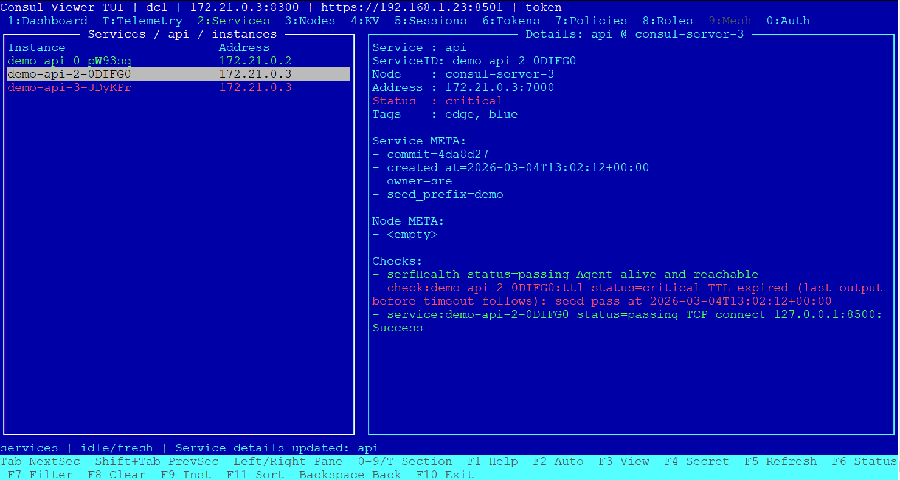
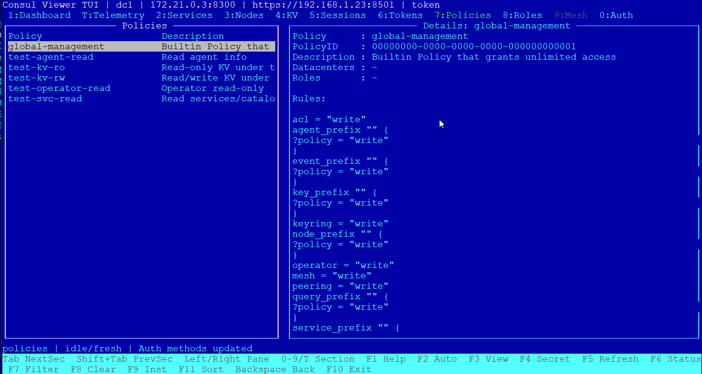

# Consul Viewer TUI

[](https://www.python.org/)
[](LICENSE)
[](./CHANGELOG.md)




`Consul Viewer TUI` is a keyboard-first, read-only terminal UI for inspecting Consul.

The application is implemented as a single Python file and is designed for operational diagnostics without modifying Consul data.

## Features

- Read-only access to Consul data
- Dashboard with cluster and local agent summary
- Telemetry panel based on Prometheus-formatted agent metrics
- Services and service instances
- Nodes and node instances
- KV browser with value preview and full viewer
- Sessions list and details
- ACL sections:
  - Tokens
  - Policies
  - Roles
  - Auth Methods
- Layered filtering:
  - text filter
  - status filter
  - structured instance filter by tags and metadata
- Per-view sorting
- Background loading, TTL cache, stale state handling

## Requirements

- Python 3.9+
- `urwid`

## Installation

Install the only external dependency:

```bash
pip install urwid
```

## Usage

Basic run:

```bash
python consul-viewer.py
```

Examples:

```bash
python consul-viewer.py --addr http://127.0.0.1:8500
python consul-viewer.py --addr https://consul.example.org:8501 --token <TOKEN>
python consul-viewer.py --refresh 10 --timeout 15
```

Supported CLI options:

- `--addr`
- `--token`
- `--refresh`
- `--timeout`
- `--insecure`
- `--dc`
- `--ca-file`
- `--cert-file`
- `--key-file`

Supported environment variables:

- `CONSUL_HTTP_ADDR`
- `CONSUL_HTTP_TOKEN`

## Keyboard Highlights

- `Tab` / `Shift+Tab` / `Ctrl+Tab` - switch sections
- `Left` / `Right` - switch between `Items` and `Details`
- `Enter` - drill down into the selected object
- `Backspace` - go back
- `F1` - help
- `F3` - full viewer
- `F4` - show token `SecretID`
- `F5` - refresh current section
- `F6` - status filter
- `F7` or `/` - text filter
- `F8` - choose which filters to clear
- `F9` - structured instance filter
- `F11` - sorting
- `F10` / `Esc` - exit confirmation

## Key Files

- `consul-viewer.py` - main application
- `UserGuide.md` - detailed English user guide
- `UserGuide-ru.md` - detailed Russian user guide
- `plan.md` - current implementation plan / tracker
- `diagramms/` - PlantUML architecture diagrams

## Notes

- The application is read-only by design.
- Mesh functionality is currently not implemented.
- Some health and telemetry statuses are heuristic and meant for operational guidance.

## Author

**Tarasov Dmitry**
- Email: dtarasov7@gmail.com

## Attribution
Parts of this code were generated with assistance
